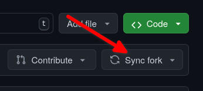

# Memo lcn
Pour pousser dans le repo “lcn” nos travaux sur Docker :

*   Aller sur le fork : [https://github.com/XavierFigari/lcn](https://github.com/XavierFigari/lcn) 
*   sync fork : 
    
    
    
*   git pull
*   Create (or checkout) a branch
*   git add + commit
*   git push
*   Make a pull request on Fork : from branch to base repo :

