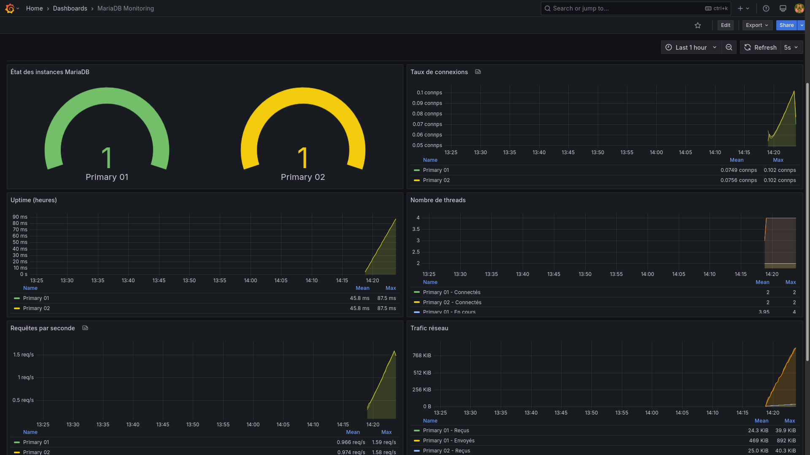

# Projet de Réplication MariaDB Master-Master

Ce projet implémente une solution de réplication MariaDB master-master avec surveillance Prometheus/Grafana pour garantir la haute disponibilité et le monitoring des performances.

## Prérequis

- Docker Engine (version 20.10.0 ou supérieure)
- Docker Compose (version 2.0 ou supérieure)
- 4GB RAM minimum disponible
- Ports locaux disponibles:
  - 8080 (WordPress)
  - 9090 (Prometheus)
  - 9104, 9105 (MySQL Exporters)
  - 3000 (Grafana)

## Installation et lancement

1. Clonez ce dépôt sur votre machine locale:
```bash
git clone <URL_DU_REPO>
cd <DOSSIER_DU_REPO>
```

2. Lancez l'environnement et vérifiez la configuration de réplication:
```bash
bash main.sh
```

3. Accès aux services:
   - WordPress: localhost:8080
   - Prometheus: localhost:9090
   - Grafana: localhost:3000 (identifiants: admin/admin)

## Preuves de travail

### 1. Fonctionnement des moteurs de base de données

Notre projet utilise deux instances de MariaDB 11.7.2 en réplication master-master.

**Preuves:**
- Vérification de l'état des deux nœuds via `main.sh` qui teste:
  - L'état des threads de réplication (`Slave_IO_Running: Yes` et `Slave_SQL_Running: Yes`)
  - La réplication bidirectionnelle des données par création de table et insertion depuis chaque nœud

Si tout fonctionne correctement, vous verrez le message:
```
Réplication master-master configurée avec succès!
Réplication bidirectionnelle des tables vérifiée avec succès!
```

Pour vérifier manuellement:
```bash
docker exec sql-primary01 bash -c "mariadb -uroot -ppassword1234 -e 'SHOW SLAVE STATUS\G'"
docker exec sql-primary02 bash -c "mariadb -uroot -ppassword1234 -e 'SHOW SLAVE STATUS\G'"
```

### 2. Sécurité et droits d'accès

Notre implémentation utilise une approche sécurisée pour la réplication et le monitoring.

**Preuves:**
- Utilisateur dédié à la réplication avec droits minimaux:
```bash
docker exec sql-primary01 bash -c "mariadb -uroot -ppassword1234 -e 'SHOW GRANTS FOR \"replication_user\"@\"%\";'"
```
Le résultat devrait montrer uniquement: `GRANT REPLICATION SLAVE ON *.* TO 'replication_user'@'%'`

- Utilisateur de monitoring avec droits restreints:
```bash
docker exec sql-primary01 bash -c "mariadb -uroot -ppassword1234 -e 'SHOW GRANTS FOR \"monitoring_user\"@\"%\";'"
```
Le résultat devrait montrer uniquement: `GRANT PROCESS, REPLICATION CLIENT ON *.* TO 'monitoring_user'@'%'`

- Configuration sécurisée dans les fichiers `.cnf` incluant:
  - Restriction du nombre de connexions
  - Gestion des erreurs de connexion
  - Optimisation des performances et de la sécurité
# Différences entre privilèges MariaDB/MySQL

## `PROCESS` vs `REPLICATION CLIENT` vs `REPLICATION SLAVE`

Ces trois privilèges servent à des fins différentes dans un environnement de base de données MariaDB/MySQL:

### `PROCESS`

**Ce privilège permet de:**
- Voir tous les threads en cours d'exécution (processus) via `SHOW PROCESSLIST`
- Accéder aux informations sur l'état du serveur
- Voir les requêtes exécutées par d'autres sessions, y compris les requêtes qui peuvent contenir des données sensibles

**Cas d'utilisation typique:**
- Monitoring et debugging
- Administrateurs système qui ont besoin de voir l'activité du serveur
- Outils de surveillance pour détecter les problèmes de performance

**Niveau de privilège:**
- Considéré comme un privilège élevé car il permet de voir potentiellement des données sensibles dans les requêtes

### `REPLICATION CLIENT`

**Ce privilège permet de:**
- Utiliser les commandes `SHOW MASTER STATUS`, `SHOW SLAVE STATUS`
- Interroger l'état de la réplication
- Accéder aux informations sur les positions de journal binaire

**Cas d'utilisation typique:**
- Outils de monitoring de réplication
- Applications qui doivent vérifier l'état de réplication sans participer à la réplication
- Services de surveillance pour alerter en cas de problèmes de réplication

**Niveau de privilège:**
- Privilège d'information seulement, ne permet pas d'établir une réplication

### `REPLICATION SLAVE`

**Ce privilège permet de:**
- Connecter une instance en tant qu'esclave (slave/replica)
- Lire les journaux binaires du maître (master)
- Établir et maintenir une connexion de réplication

**Cas d'utilisation typique:**
- Serveurs configurés comme esclaves dans une topologie de réplication
- Instances qui doivent recevoir des données répliquées

**Niveau de privilège:**
- Privilège plus puissant car il permet d'accéder à toutes les données répliquées

## Résumé des différences clés:

| Privilège | Fonction principale | Accès aux données | Risque de sécurité |
|-----------|---------------------|-------------------|-------------------|
| `PROCESS` | Voir tous les processus en cours | Peut voir des informations sensibles dans les queries | Moyen à élevé |
| `REPLICATION CLIENT` | Vérifier l'état de réplication | Informations sur la réplication uniquement | Faible |
| `REPLICATION SLAVE` | Établir une connexion de réplication | Toutes les données répliquées | Élevé |

## Dans votre contexte:

Dans votre configuration:
- Le `monitoring_user` a les privilèges `PROCESS, REPLICATION CLIENT` qui sont suffisants pour que Prometheus/Grafana puisse surveiller l'état des serveurs et de la réplication sans pouvoir modifier quoi que ce soit
- Le `replication_user` a le privilège `REPLICATION SLAVE` qui est nécessaire pour que vos deux serveurs MariaDB puissent établir une réplication bidirectionnelle

Cette séparation des privilèges suit le principe de sécurité du "moindre privilège", où chaque utilisateur ne reçoit que les privilèges strictement nécessaires à sa fonction.
### 3. Indicateurs de performance

Notre solution utilise la stack Prometheus/Grafana pour surveiller les métriques clés.

**Preuves:**
- Dashboard Grafana pré-configuré accessible sur localhost:3000:
  - Métriques de réplication (délai, statut)
  - Métriques de performance (requêtes/sec, temps de réponse)
  - Utilisation des ressources (connexions, mémoire)

- Exportateurs MySQL collectant des métriques détaillées:
  - localhost:9104/metrics (primary01)
  - localhost:9105/metrics (primary02)

- Prometheus stockant les métriques temporelles:
  - Interface permettant de requêter ces métriques: localhost:9090

**Indicateurs clés à surveiller:**
- État de la réplication: `mysql_slave_status_slave_io_running`, `mysql_slave_status_slave_sql_running`
- Retard de réplication: `mysql_slave_status_seconds_behind_master`
- Performance: `mysql_global_status_queries`, `mysql_global_status_slow_queries`
- Ressources: `mysql_global_status_threads_connected`, `mysql_global_status_innodb_buffer_pool_pages_free`

## Architecture du projet

```
├── docker-compose.yml          # Configuration des services Docker
├── fix_permissions.sql         # Script pour configurer les accès MySQL
├── main.sh                     # Script principal de déploiement et test
├── primary01.cnf               # Configuration du premier nœud MariaDB
├── primary02.cnf               # Configuration du second nœud MariaDB
├── prometheus.yml              # Configuration Prometheus
├── setup_replication01.sql     # Configuration de la réplication pour primary01
└── setup_replication02.sql     # Configuration de la réplication pour primary02
```

## Dépannage

Si la réplication échoue, le script `main.sh` tente de résoudre les problèmes en exécutant:
```sql
STOP SLAVE; SET GLOBAL SQL_SLAVE_SKIP_COUNTER=1; START SLAVE;
```

Pour redémarrer complètement le projet:
```bash
docker compose down -v
bash main.sh
```